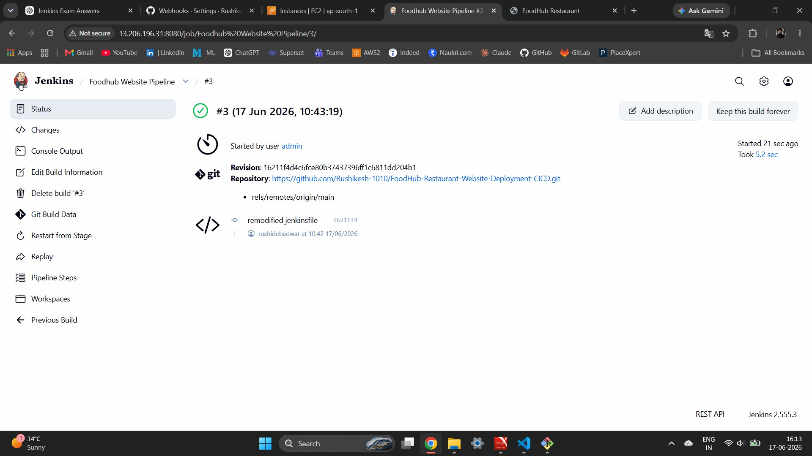
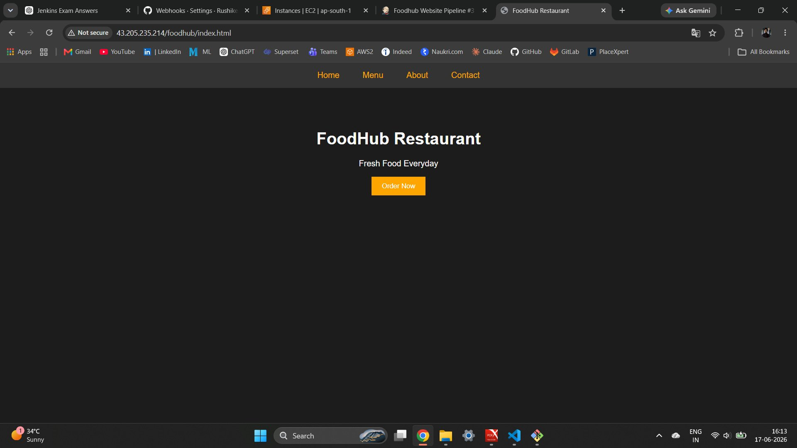
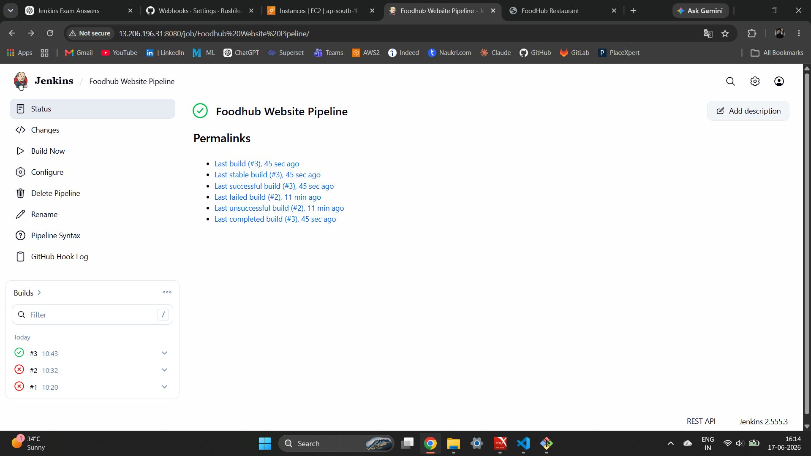
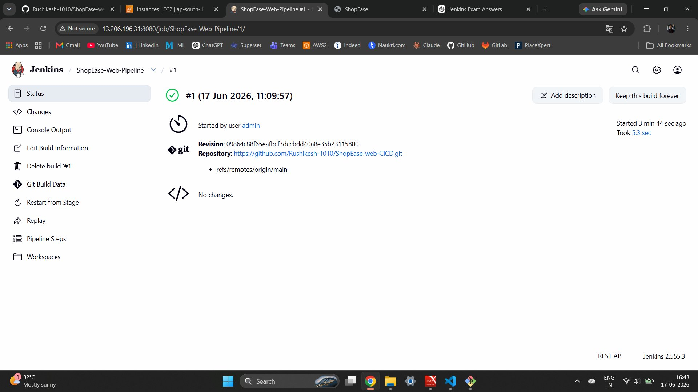
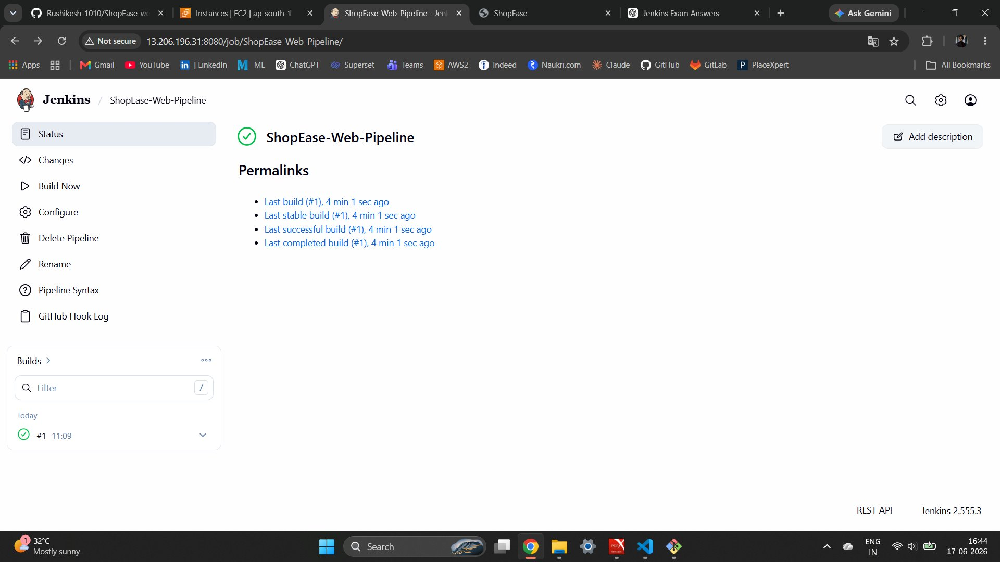
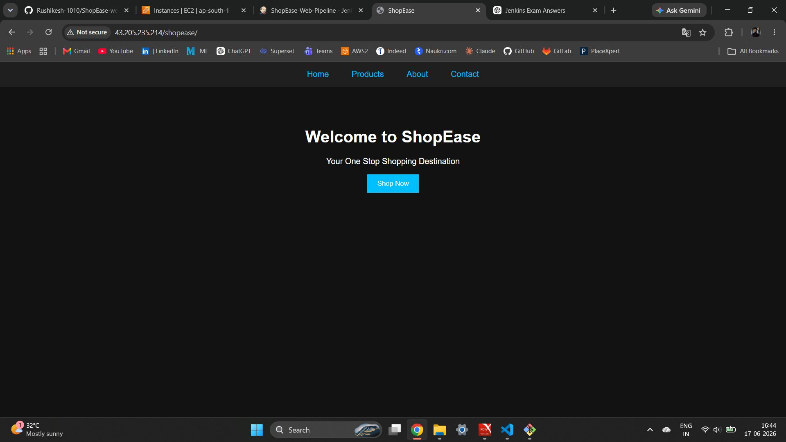
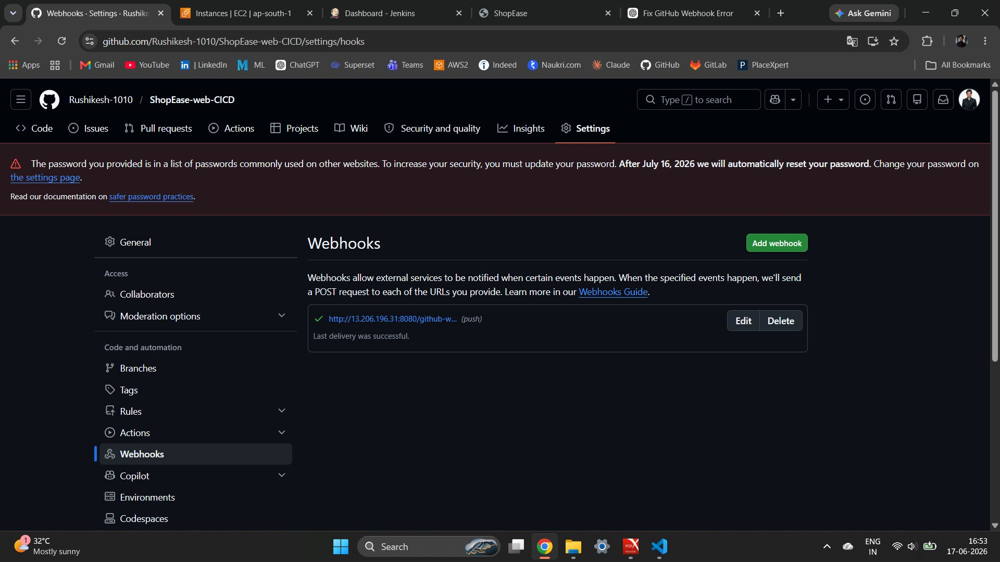
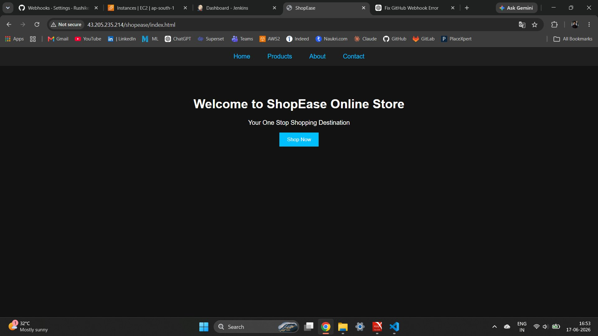
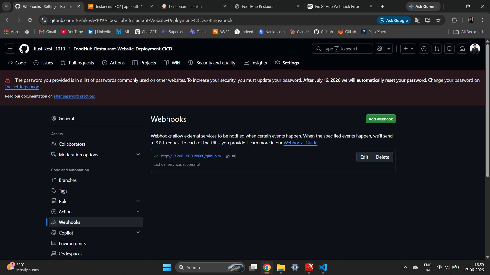
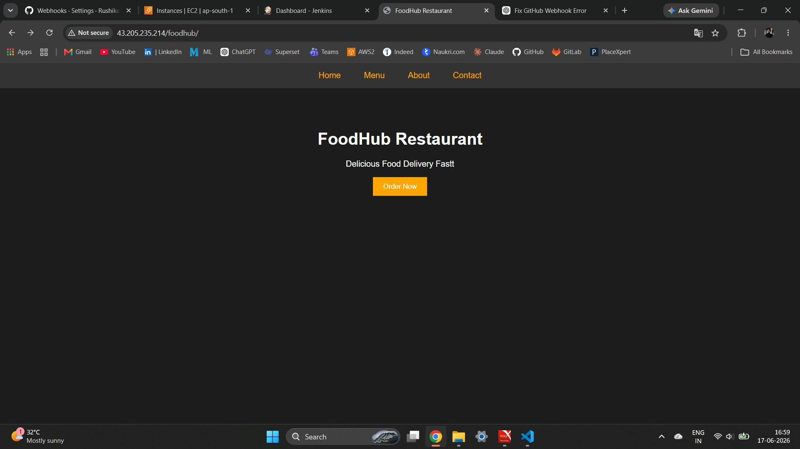

# Jenkins CI/CD Project

## Jenkins MCQ Answers

| # | Question | Answer |
|---|----------|--------|
| 1 | What is Jenkins mainly used for? | **B) Continuous Integration and Continuous Delivery** |
| 2 | Which type of job allows you to define build steps using code in Jenkins? | **B) Pipeline Project** |
| 3 | Which file is used to define a pipeline in Jenkins? | **C) Jenkinsfile** |
| 4 | What is the purpose of a Jenkins Agent (Node)? | **B) To execute jobs assigned by the Jenkins controller** |
| 5 | Which plugin is required to connect Jenkins with GitHub? | **B) Git Plugin** |
| 6 | What is the purpose of a Webhook in Jenkins CI/CD? | **B) To trigger build automatically on code push** |
| 7 | Which command is used inside Jenkins Pipeline to execute shell commands? | **C) sh** |
| 8 | What is the purpose of `post` block in Jenkins Pipeline? | **B) Execute steps after pipeline stages** |
| 9 | What is the use of `sshagent` in Jenkins Pipeline? | **C) Use stored SSH credentials during execution** |
| 10 | What happens if a stage fails in Jenkins Pipeline (by default)? | **B) The pipeline stops execution** |

---

## Jenkins CI/CD Practical Test

### Project Overview

Deployed two static websites on a single target server using Jenkins CI/CD pipelines with GitHub webhook-based auto-deployment.

| | Details |
|---|---|
| **Jenkins Server** | `13.206.196.31:8080` |
| **Target Server** | `43.205.235.214` (Private IP: `172.31.15.141`) |
| **App 1** | FoodHub Restaurant Website → `/foodhub` |
| **App 2** | ShopEase Website → `/shopease` |

---

## Task 1: Infrastructure Setup

### Jenkins Server
- Launched EC2 instance (Ubuntu), installed Java + Jenkins
- Installed plugins: Git Plugin, SSH Agent Plugin, GitHub Integration Plugin
- Configured SSH credentials (`node-pipeline-key-node.js`) for target server
- Jenkins accessible at: `http://13.206.196.31:8080`

### Target Server
- Launched EC2 instance (Ubuntu), installed Nginx
- Opened port 80 in Security Group
- Configured Nginx with two location blocks for `/foodhub` and `/shopease`

---

## Task 2: Deploy Both Applications on Same Server

Both apps deployed on the same target server under separate paths:

```
http://43.205.235.214/foodhub   → /var/www/html/foodhub
http://43.205.235.214/shopease  → /var/www/html/shopease
```

**Nginx configuration (`/etc/nginx/sites-available/default`):**

```nginx
server {
    listen 80;

    location /foodhub {
        alias /var/www/html/foodhub;
        index index.html;
    }

    location /shopease {
        alias /var/www/html/shopease;
        index index.html;
    }
}
```

---

## Task 3: Jenkins Pipeline Jobs

### Pipeline 1 — Foodhub Website Pipeline

**Repository:** `https://github.com/Rushikesh-1010/FoodHub-Restaurant-Website-Deployment-CICD.git`

**Jenkinsfile:**

```groovy
pipeline {
    agent any
    stages {
        stage('Clone FoodHub Code') {
            steps {
                git branch: 'main',
                url: 'https://github.com/Rushikesh-1010/FoodHub-Restaurant-Website-Deployment-CICD.git'
            }
        }
        stage('Deploy to Target Server') {
            steps {
                sshagent(['node-pipeline-key-node.js']) {
                    sh '''
                    ssh ubuntu@172.31.15.141 "
                    sudo rm -rf /var/www/html/foodhub/*
                    "
                    scp -r * ubuntu@172.31.15.141:/var/www/html/foodhub/
                    '''
                }
            }
        }
        stage('Restart Nginx') {
            steps {
                sshagent(['node-pipeline-key-node.js']) {
                    sh '''
                    ssh ubuntu@172.31.15.141 "
                    sudo systemctl restart nginx
                    "
                    '''
                }
            }
        }
        stage('Verify Deployment') {
            steps {
                sshagent(['node-pipeline-key-node.js']) {
                    sh '''
                    ssh ubuntu@172.31.15.141 "
                    ls -la /var/www/html/foodhub
                    "
                    '''
                }
            }
        }
    }
    post {
        success {
            echo "FoodHub Deployment Successful"
        }
        failure {
            echo "FoodHub Deployment Failed"
        }
    }
}
```

**Build History:**

| Build | Status | Time |
|-------|--------|------|
| #3 | ✅ Success | 17 Jun 2026, 10:43:19 — Took 5.2 sec |
| #2 | ❌ Failed | 17 Jun 2026, 10:32 |
| #1 | ❌ Failed | 17 Jun 2026, 10:20 |

### Screenshot — Foodhub Build #3 Success


### Screenshot — Foodhub Website Live


### Screenshot — Foodhub Pipeline Status


---

### Pipeline 2 — ShopEase Web Pipeline

**Repository:** `https://github.com/Rushikesh-1010/ShopEase-web-CICD.git`

**Jenkinsfile:**

```groovy
pipeline {
    agent any
    stages {
        stage('Clone ShopEase Code') {
            steps {
                git branch: 'main',
                url: 'https://github.com/Rushikesh-1010/ShopEase-web-CICD.git'
            }
        }
        stage('Deploy to Target Server') {
            steps {
                sshagent(['node-pipeline-key-node.js']) {
                    sh '''
                    ssh ubuntu@172.31.15.141 "
                    sudo rm -rf /var/www/html/shopease/*
                    "
                    scp -r * ubuntu@172.31.15.141:/var/www/html/shopease/
                    '''
                }
            }
        }
        stage('Restart Nginx') {
            steps {
                sshagent(['node-pipeline-key-node.js']) {
                    sh '''
                    ssh ubuntu@172.31.15.141 "
                    sudo systemctl restart nginx
                    "
                    '''
                }
            }
        }
        stage('Verify Deployment') {
            steps {
                sshagent(['node-pipeline-key-node.js']) {
                    sh '''
                    ssh ubuntu@172.31.15.141 "
                    ls -la /var/www/html/shopease
                    "
                    '''
                }
            }
        }
    }
    post {
        success {
            echo "ShopEase Deployment Successful"
        }
        failure {
            echo "ShopEase Deployment Failed"
        }
    }
}
```

**Build History:**

| Build | Status | Time |
|-------|--------|------|
| #1 | ✅ Success | 17 Jun 2026, 11:09:57 — Took 5.3 sec |

### Screenshot — ShopEase Build #1 Success


### Screenshot — ShopEase Pipeline Status


### Screenshot — ShopEase Website Live (Initial)


---

## Task 4: GitHub Webhooks Configuration

Configured webhooks in both GitHub repositories pointing to:

```
http://13.206.196.31:8080/github-webhook/
```

- **Trigger:** Push events only
- **Last delivery:** Successful ✅

### Screenshot — ShopEase Webhook


### Screenshot — ShopEase Website After Webhook Trigger


### Screenshot — FoodHub Webhook


### Screenshot — FoodHub Website After Webhook Trigger


---

## Task 5: Content Changes & Auto Deployment

### FoodHub Website

| | |
|---|---|
| **Before** | `Fresh Food Everyday` |
| **After** | `Delicious Food Delivered Fast` |
| **Committed by** | rushidebadwar at 10:42, 17/06/2026 |
| **Auto build triggered** | ✅ Build #3 — Success |

### ShopEase Website

| | |
|---|---|
| **Before** | `Welcome to ShopEase` |
| **After** | `Welcome to ShopEase Online Store` |
| **Auto build triggered** | ✅ Webhook triggered after push |

---

## Task 6: Troubleshooting

Builds #1 and #2 of FoodHub pipeline failed. Issues identified and resolved:

| Issue | Fix Applied |
|---|---|
| SSH key not configured | Added SSH private key as Jenkins credential (`node-pipeline-key-node.js`) |
| Wrong deployment path | Corrected path to `/var/www/html/foodhub/` in Jenkinsfile |
| Nginx permission denied | Set correct ownership using `chown` on target server |
| GitHub webhook 403 error | Enabled **GitHub hook trigger for GITScm polling** in pipeline config |
| `StrictHostKeyChecking` blocking SSH | Added `-o StrictHostKeyChecking=no` in `ssh`/`scp` commands |

Build #3 succeeded after all fixes. ✅

---

## Bonus Task: Nginx Sub-path Routing

Both websites served from the same IP on port 80 using Nginx `alias` routing — no different ports needed:

```
http://43.205.235.214/foodhub   ✅ FoodHub Restaurant Website
http://43.205.235.214/shopease  ✅ ShopEase Website
```

---

## Deliverables Summary

| # | Deliverable | Status |
|---|---|---|
| 1 | Jenkins pipeline screenshots | ✅ |
| 2 | GitHub webhook configuration screenshots | ✅ |
| 3 | Browser output of both applications | ✅ |
| 4 | Jenkins build success screenshots | ✅ |
| 5 | GitHub commit history | ✅ |
| 6 | Target server deployment proof | ✅ |

---

## GitHub Repositories

| Repo | Link |
|---|---|
| Main Project | https://github.com/Rushikesh-1010/Jenkins-Project-CICD.git |
| FoodHub CI/CD | https://github.com/Rushikesh-1010/FoodHub-Restaurant-Website-Deployment-CICD.git |
| ShopEase CI/CD | https://github.com/Rushikesh-1010/ShopEase-web-CICD.git |
